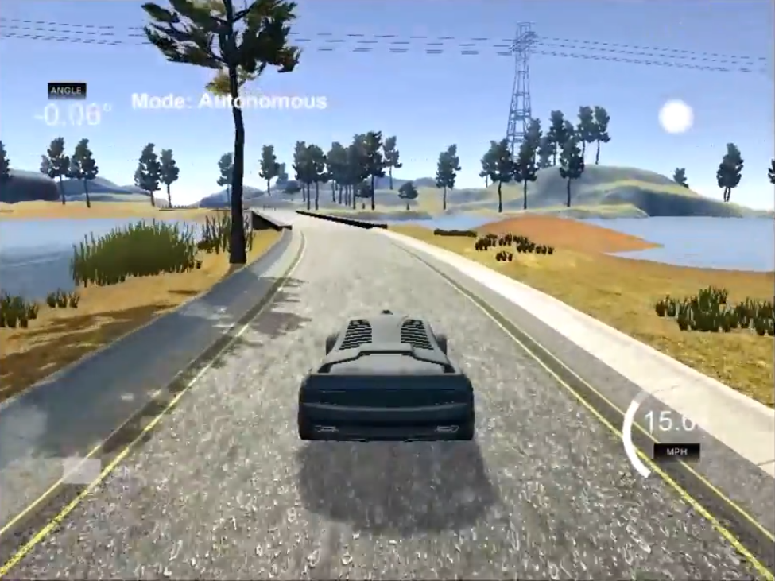
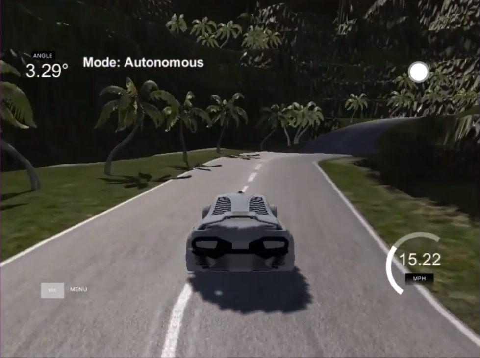

# **Behavioral Cloning** 


---

**Behavioral Cloning Project**

The goals / steps of this project are the following:
* Use the simulator to collect data of good driving behavior
* Build, a convolution neural network in Keras that predicts steering angles from images
* Train and validate the model with a training and validation set
* Test that the model successfully drives around track one without leaving the road
* Summarize the results with a written report


[//]: # (Image References)

[image1]: ./Images/nvidia.png "nvidia"
[image2]: ./Images/mixedv2.png "model_sedi_mixedv2"
[image3]: ./Images/circuit1.png "circuit1"
[image4]: ./Images/Circuit2.png "circuit2"
[image5]: ./Images/placeholder_small.png "Recovery Image"
[image6]: ./Images/placeholder_small.png "Normal Image"
[image7]: ./Images/placeholder_small.png "Flipped Image"

## Rubric Points
### Here I will consider the [rubric points](https://review.udacity.com/#!/rubrics/432/view) individually and describe how I addressed each point in my implementation.  

---
### Files Submitted & Code Quality

#### 1. Submission includes all required files and can be used to run the simulator in autonomous mode

My project includes the following files:
* model.py containing the script to create and train the model
* drive.py for driving the car in autonomous mode
* model_sedi_mixedv2.h5 containing a trained convolution neural network 
* writeup_report.md or writeup_report.pdf summarizing the results

#### 2. Submission includes functional code
Using the Udacity provided simulator and my drive.py file, the car can be driven autonomously around the track by executing 
```sh
python drive.py model_sedi_mixedv2.h5
```

#### 3. Submission code is usable and readable

The model.py file contains the code for training and saving the convolution neural network. The file shows the pipeline I used for training and validating the model, and it contains comments to explain how the code works.

### Model Architecture and Training Strategy

#### 1. An appropriate model architecture has been employed

As a basic module I used the network architecture of [NVIDIA](https://devblogs.nvidia.com/parallelforall/deep-learning-self-driving-cars/) and added some features. At first the input data is normalized using a Keras lambda layer (model.py line 72-74). Up on this the images get cropped by a Keras cropping layer (line 75). Because the areas at the bottom and the top of the images include informations that are not important for the network and also could irritate its learning and output, the top 70 pixel and the lower 20 pixel at the bottom were removed. So the shape of the images changes from (160, 320, 3) to (70, 320, 3). Next the architecture of NVIDIAs network start. At first three convolutional layers with a 2x2 stride and a 5x5 kernel (model.py lines 76-78). Followed by a non-strided convolution with a 3×3 kernel size in the final two convolutional layers (lines 79-80).
After the five convolutional layers three fully connected layers paired with two dropout layers (keep probability = 0.4) to reduce overfitting are added (model.py line 83,85 ). All convolutional and fully conected layers contain the RELU activation function to introduce nonlinearity. The final network architecture looks like this:


| Layer         		|     Description	        					    | 
| :---------------------: | :---------------------------------------------: | 
| Input         		| 160x320x3 RGB image   						    | 
| Lambda         		| normalization          					 	    | 
| Cropping         		| Input (170,320,3) , Output (70,320,3)			    | 
| Convolution 1     	| 2x2 stride, 5x5 kernel, activation = RELU    	    |
| Convolution 2			| 2x2 stride, 5x5 kernel, activation = RELU		    |
| Convolution 3	      	| 2x2 stride, 5x5 kernel, activation = RELU  	    |
| Convolution 4 	    | 3x3 kernel, activation = RELU                 	|
| Convolution 5    		| 3x3 kernel, activation = RELU		     		   	|
| Flatten    			| Input = , Output = 1164	                        |
| Fully Connected 1		| Input = 1164, Output = 100 , activatio = RELU 	|
| Dropout        		| keep_prob = 0.4						            |
| Fully Connected 2 		| Input = 100, Output = 50, activaiton = RELU	|
| Dropout        		| keep_prob = 0.4                   				|
| Fully Connected 3		| Input = 50, Output = 10, activation = RELU		|
| Output layer      		| Input = 10, Output = 1, actuvation = RELU	    |


The model was tested by running it through the simulator and ensuring that the vehicle could stay on the track.

#### 3. Model parameter tuning

The model used an adam optimizer, so the learning rate was not tuned manually (model.py line 90).

#### 4. Appropriate training data

To generate a valueable dataset to train the network I drove the first training circuit multiple times in the regular direction and reversed direction. For drive the car I noticed that a controller is giving the smoothest steering angles/behavior. Therefor on the final dataset I used a controller to steer the car and drove the track 5 laps in regular and 5 laps in reversed direction. After testing I noticed that the model has some problems with sharp turns, so I decided to generate extra data for the sharp turns an drove them multiple times so the model has more data to learn these curves. 

| Dataset History |
| ---   |
| regular direction   5 laps               |
| reverse direction   5 laps               |
| multiple sharp curves regular direction  |
| multiple sharp curves reversed direction |

### Video of the model on circuit 1:

<a href="https://www.youtube.com/watch?v=pIqWvn6jHCo
" target="_blank"></a>

After my model successfully completed circuit 1 (on all velocities between 9-30 mp/h) I was curious how it would perform on the second circuit without training for it.
Well, it performed pretty bad, so I added 2 laps on training mode to the dataset and trained a model on this, now mixed dataset. 
Its performence increased dramatically and it almost completed 80% of the lap. I observed the critical sections on the circuit and collected additional training data for especially these situations/sections. After training a new model on this extendet dataset it successfully completed the whole circuit 2. And in my opinion its performence on circuit 1 also increased a bit. I guess its a result of a better data distribution.

| Mixed-Dataset History |
| ---   |
| regular direction   5 laps               |
| reverse direction   5 laps               |
| multiple sharp curves regular direction  |
| multiple sharp curves reversed direction |
| 2 laps on Circuit 2  |
| critical situations and sharp turns on Circuit 2 |

Final learning history: 

![alt text][image2]

### Video of the final model on circuit 2:

<a href="https://www.youtube.com/watch?v=pzMp2ard7_I
" target="_blank"></a>

